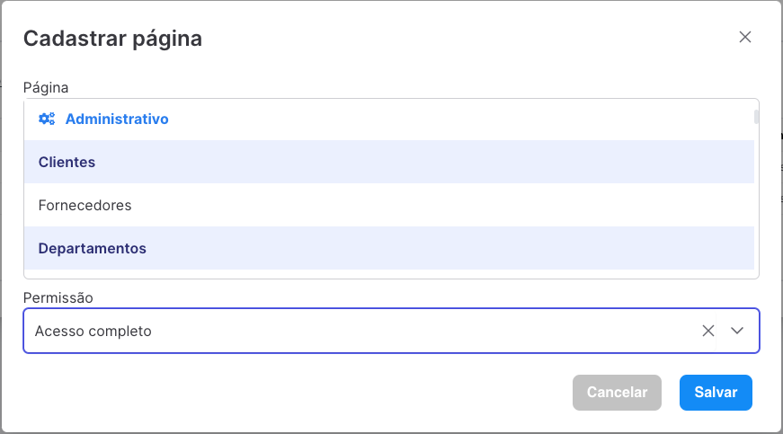

# Grupos de acesso

> Nesta página você pode controlar os grupos de acesso do sistema. Crie diferentes grupos que reflitam a estrutura da sua empresa, como departamentos e setores.

#### Formulário

| Campo                 | Obrigatório   | Descrição |
| --------------------- |:-------------:|---------- |
| Grupo de acesso       | **Sim**       | Nome do grupo de acesso |

#### Ações

| Ícone                 | Ação |
| --------------------- |-------------|
|       | Acesso aos dados do grupo, onde poderá visualizar as páginas e usuários que pertencem ao grupo |
|       | Abre o formulário para edição do grupo de acesso |
|       | Apaga o grupo de acesso. _Somente usuários com **acesso avançado** irão visualizar esse ícone._ |

## Home

> Caso queira voltar à página principal, basta clicar no título da página.

## Páginas

> Gerencie as páginas que o Grupo de Acesso poderá acessar e as interações que terá.

#### Formulário
| Campo                 | Obrigatório   | Descrição |
| --------------------- |:-------------:|---------- |
| Página       | **Sim**       | Selecione a(s) página(s) que o grupo terá acesso. _Não é preciso pressionar teclas para selecionar. Basta clicar sobre o nome da página._ |
| Permissão       | **Sim**       | Selecione o permissão que o usuário terá na(s) página(s) selecionada(s). _Será detalhado abaixo cada permissão._ |

| Campo                 | Descrição |
| --------------------- |-------------|
| Somente leitura       | O usuário apenas verás as informações da página, podendo acessar a Home quando exista. |
| Acesso completo       | O usuário poderá cadastrar e editar informações. |
| Avançado              | Além das permissões do acesso completo, o usuário poderá excluir os dados. Em algumas páginas o usuário poderá visualizar informações restritas ou executar ações especiais - _Será detalhado na documentação da página que for aplicável_. |

## Usuários

> Gerencie os usuários que pertencem ao grupo de acesso. Também é possível cadastrar a partir da página de [usuários](administrative/users.md)

#### Formulário

| Campo                 | Obrigatório   | Descrição |
| --------------------- |:-------------:|---------- |
| Nome       | **Sim**       | Nome completo do usuário |
| Email       | **Sim**       | Email do usuário |
| Departamento       | Não       | Departamento que pertence o usuário |

_Será gerado uma senha aleatória e enviada por email para o usuário._