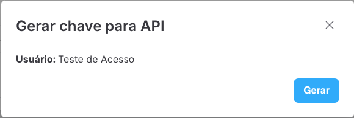
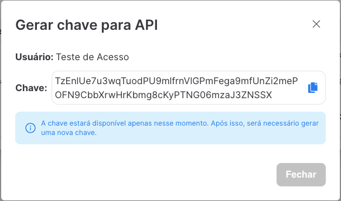

# Usuários

> Gerencie todos os usários do sistema.

#### Formulário

| Campo           | Obrigatório | Descrição                           |
| --------------- | :---------: | ----------------------------------- |
| Grupo           |   **Sim**   | Grupo que pertencerá o usuário      |
| Modelo          |   **Sim**   | Nome completo do usuário            |
| Equipamento     |   **Sim**   | Email do usuário                    |
| Numero de serie |     Não     | Departamento que pertence o usuário |
| Fabricante      |     Não     | Departamento que pertence o usuário |
| Colaborador     |     Não     | Departamento que pertence o usuário |

_Será gerado uma senha aleatória e enviada por email para o usuário._

#### Ações

| Ícone                                  | Ação                                                                                                                    |
| -------------------------------------- | ----------------------------------------------------------------------------------------------------------------------- |
|  | Abre o formulário para edição do grupo de acesso                                                                        |
|   | Apaga o grupo de acesso. _Somente usuários com **acesso avançado** irão visualizar esse ícone._                         |
|     | Gera uma chave aleatória para integração com a API. Ao clicar será aberto um formulário como o que vê na imagem abaixo. |

Após clicar no botão **Gerar**, o sistema irá exibir a chave gerada para que seja copiada. A chave está disponível uma única vez.

