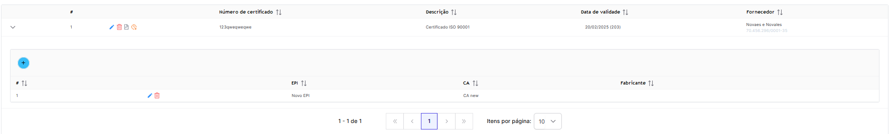

# Grupos

> Gerencie todos os grupos do PPES.

#### Formulário

| Campo                 | Obrigatório | Descrição              |
| --------------------- | :---------: | ---------------------- |
| Numero de certificado |   **Sim**   | Número do certificado  |
| Descrição             |   **Sim**   | Descrição do grupo EPI |
| Data de validade      |   **Sim**   | Data de validação      |
| Fornecedor            |   **Sim**   | Nome do provedor       |

#### Ações

| Ícone                                    | Ação                                                                                                     |
| ---------------------------------------- | -------------------------------------------------------------------------------------------------------- |
|    | Abre o formulário para edição do grupo PPE                                                               |
|     | Apaga o grupo PPE. _Somente usuários com **acesso avançado** irão visualizar esse ícone._                |
|  | Você pode visualizar o grupo EPI. _Somente usuários com **acesso avançado** irão visualizar esse ícone._ |
|    | _Somente usuários com **acesso avançado** irão visualizar esse ícone._                                   |

> Neste pequeno menu suspenso podemos visualizar seu EPI

#### Formulário

| Campo      | Obrigatório | Descrição                |
| ---------- | :---------: | ------------------------ |
| EPI        |   **Sim**   | Tipo de EPI              |
| CA         |   **Sim**   | Certificado de aprovação |
| Fabricante |   **Sim**   | Fabricante responsável   |

|
