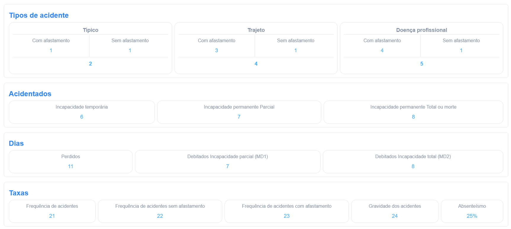

# Gerenciador de Absenteísmo

> Gerenciador de absenteísmo, aqui você pode: criar, editar, visualizar e excluir registros de absenteísmo.

#### Formulário

| Campo                                        | Obrigatório | Descrição                                    |
| -------------------------------------------- | :---------: | -------------------------------------------- |
| Ano                                          |   **Sim**   | Ano do registro                              |
| Mês                                          |   **Sim**   | Mês do registro                              |
| Funcionários                                 |   **Sim**   | Número de funcionários                       |
| Dias úteis                                   |     Não     | Número de dias úteis                         |
| Horas trabalhadas                            |     Não     | Número de horas trabalhadas                  |
| Incapacidade temporária                      |     Não     | Dias de incapacidade temporária              |
| Incapacidade permanente                      |     Não     | Dias de incapacidade permanente              |
| Dias perdidos                                |     Não     | Dias perdidos devido a acidentes             |
| Dias debitados                               |     Não     | Dias debitados                               |
| Frequência de acidentes                      |     Não     | Frequência de acidentes                      |
| Taxa de frequência de acidentes sem ausência |     Não     | Taxa de frequência de acidentes sem ausência |
| Taxa de frequência de acidentes com ausência |     Não     | Taxa de frequência de acidentes com ausência |
| Taxa de severidade                           |     Não     | Taxa de severidade                           |
| Taxa de absenteísmo                          |     Não     | Taxa de absenteísmo                          |
| Dias sem acidentes                           |     Não     | Número de dias sem acidentes                 |
| Recorde de dias sem acidentes                |     Não     | Recorde de dias sem acidentes                |
| Trabalho externo                             |     Não     | Dias de trabalho externo                     |
| Home office                                  |     Não     | Dias de home office                          |
| Funcionários ausentes                        |     Não     | Número de funcionários ausentes              |

#### Ações

| Ícone                                    | Ação                                                                                                       |
| ---------------------------------------- | ---------------------------------------------------------------------------------------------------------- |
|    | Abre o formulário para edição do Gerenciador de absenteísmo                                                |
|     | Apaga o Gerenciador de absenteísmo. _Somente usuários com **acesso avançado** irão visualizar esse ícone._ |
|  | Acesso aos arquivos de absenteísmo, onde você poderá visualizar os registros                               |

## Home

#### Aqui você pode ver os dados carregados anteriormente com mais detalhes.

