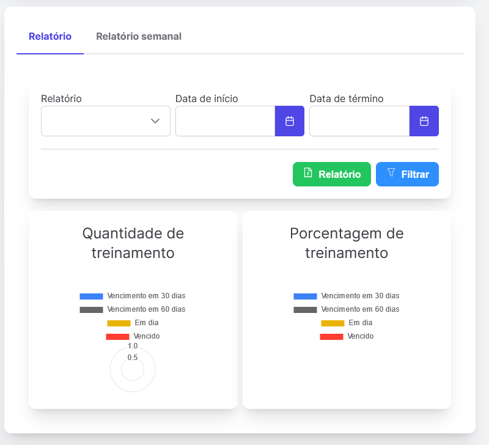
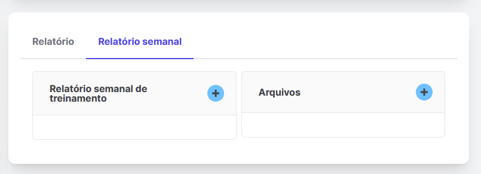

# Reports

> Aqui estamos nos relatórios de troca de equipamentos, aqui temos duas páginas que representam em gráficos um pequeno relatório do desempenho do relatório e na página do relatório semanal podemos ver o relatório semanal de treinamentos e arquivos relacionados entre si.

## Relatorio

> Neste relatório podemos representar num pequeno gráfico o dia em que o relatório foi adicionado bem como a sua validade em dias e data.

## Relatorio semanal

> Aqui podemos ver que estes são dois locais onde você pode adicionar um relatório de treinamento semanal e os arquivos correspondentes.

